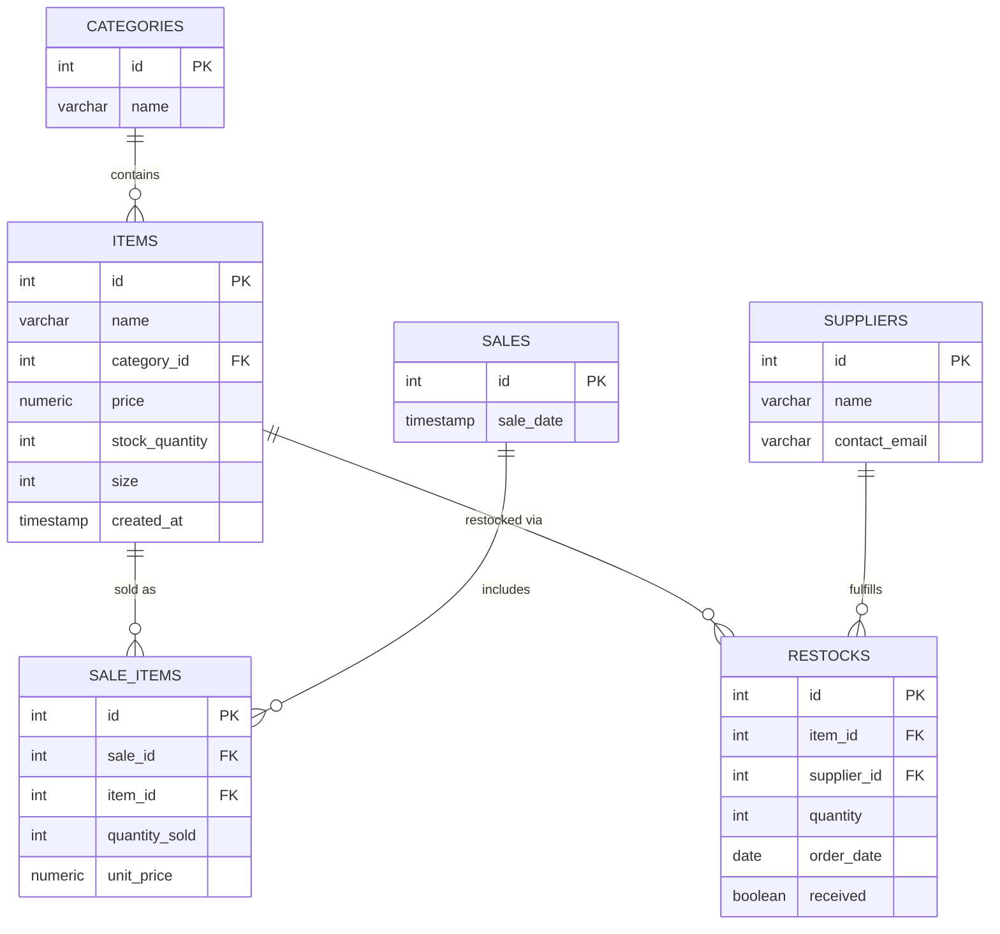
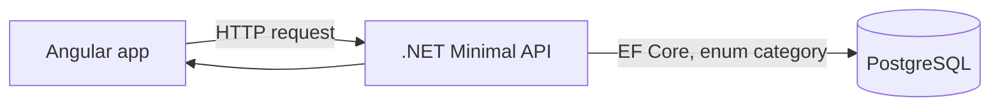
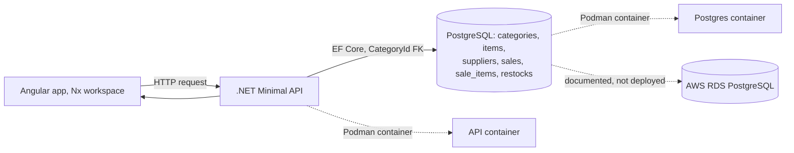

Here's the full README:

---

# Soccer Store Monorepo

A real Nx workspace, generated with create-nx-workspace and
nx g @nx/angular:app, not just files copied into a folder named right.
The Angular build was actually run and verified to succeed before this
was packaged.

## Structure

```
apps/
  api/        .NET Minimal API (backend)
  web/        Angular frontend, generated through Nx
  web-e2e/    Playwright end to end test scaffold (from the Nx generator)
infra/
  podman/     Container orchestration for the API and PostgreSQL
docs/
  AWS-RDS-SETUP.md   Guide for the AWS hosted PostgreSQL setup
nx.json, tsconfig.base.json, package.json   Nx workspace root files
```

## What's fixed in this version

- The Containerfile no longer splits dotnet restore and
  dotnet publish --no-restore into separate steps. That split caused a
  NuGet analyzer package to go missing at publish time. It's now a single
  dotnet publish step that resolves everything itself.
- apps/web is a properly generated Nx Angular application, not a plain
  Angular CLI app placed in a folder. It was generated with
  nx g @nx/angular:app apps/web.
- The page components (home, cleats, jerseys, balls, checkout) were
  copied in from the original frontend and wired into app.routes.ts,
  including balls, which existed as a component but wasn't routed yet.
- Bootstrap is installed and imported globally in src/styles.scss.
- The placeholder Nx welcome component was removed and the app shell
  (app.ts / app.html) now just renders <router-outlet>.

## Getting started

```
npm install
npx nx serve web       # runs the Angular dev server
npx nx build web        # production build, already verified to succeed
```

## Running the backend

```
cd infra/podman
cp .env.example .env
podman-compose up -d --build
curl http://localhost:8080/db-check
```

Swagger is available at http://localhost:8080/swagger once running.

## Still needed

The database side (schema, ERD, seed data, views, functions, SQL
queries, migrations) is not included in this version of the repo.
Only infrastructure and the AWS setup guide have been delivered here.

## A note on folder naming

Extract this somewhere with a plain path, avoid # or other special
characters anywhere in the folder chain (e.g. a parent folder named
"C# Angular"). Several JavaScript and Nx tools mishandle # in file
paths, which caused broken builds earlier in this project.

---

# Business Idea

## The problem

A small soccer equipment store manages its inventory by hand, on
paper or in disconnected spreadsheets. Stock counts drift out of sync
with what's actually on the shelf, staff cannot quickly tell what is
low on stock or what has sold recently, and there is no shared system
that both a sales counter and a stockroom can rely on at the same
time. As the store's catalog grows across categories, cleats, jerseys,
balls, socks, bags, jackets, shorts, and pants, manual tracking stops
being workable.

## Target users

- **Store staff**, who need to add new stock, look up an item, and
  record a sale without touching a spreadsheet.
- **A store manager**, who needs a real view of what is low on stock,
  what is selling, and what needs reordering.
- **Customers**, indirectly, through a storefront that shows what is
  actually in stock rather than a stale printed list.

## Why this is useful

A shared web application with one source of truth for inventory means
a sale actually updates stock in real time, categories stay
consistent instead of being typed differently every time, and the
business can eventually pull real reports (best sellers, low stock,
revenue by category) instead of guessing.

## Scope for this project

The proof of concept focuses on a single store's inventory and point
of sale flow: browsing items by category, adding and editing items,
and recording a sale that decreases stock. Multi-location inventory,
customer accounts, and payment processing are out of scope for this
10 week project.

# Hypotheses

| Hypothesis | Prototype | Success measure | Result |
|---|---|---|---|
| A shared .NET Minimal API will let both a frontend and a database team work independently without blocking each other. | Backend and database work were assigned to different team members and developed against an agreed API contract. | Both sides could be built and tested somewhat independently before final integration. | Partially supported. The contract drifted during development (the category model changed shape more than once), which caused real integration friction, documented below under Limitations. |
| An Angular Nx workspace will make it easier to keep frontend and backend code organized in one repository. | Generated a real Nx workspace with apps/api and apps/web side by side. | Both apps build successfully from the same workspace root. | Supported. npm install and npx nx build web both complete cleanly, and the .NET project builds independently inside its own folder. |
| Containerizing the API and PostgreSQL with Podman will make the environment reproducible across different machines. | Wrote a Containerfile and podman-compose.yml, tested locally. | Should build and run consistently regardless of who runs it. | Partially supported. It worked once several host specific issues were solved (see Limitations), but those issues show reproducibility was harder in practice than expected on this specific host setup. |
| A normalized PostgreSQL schema (separate categories table with foreign keys) will make reporting and filtering easier than a plain enum column. | Designed a proper schema with categories, items, suppliers, sales, sale_items, and restocks tables, plus views and functions. | Real queries (low stock, revenue by category, best sellers) should return correct results against seeded data. | Supported in isolation, tested successfully against a real PostgreSQL install with correct results, but not fully integrated into the version submitted here, see Limitations. |

# How the project was distributed

The team split into three roles matching the three main pieces of the
required architecture:

- **Backend**: the .NET Minimal API, endpoints, validation, container
  setup for the API itself, and integrating the frontend and database
  contracts together.
- **Frontend**: the Angular Nx application, the page components
  (home, cleats, jerseys, balls, checkout), routing, and styling.
- **Database**: the PostgreSQL schema design, seed data, views,
  functions, and the AWS RDS research and setup documentation.

Each piece was developed largely on its own, then brought together
into this shared monorepo through several merge passes as each
person's work was ready.

# Step by step: how this was built

1. **Project setup.** Chose the soccer store inventory idea, defined
   the problem and target users, and set up the required technology
   list (Angular Nx, .NET Minimal API, PostgreSQL, Podman, AWS).
2. **Initial backend prototype.** Built a flat .NET Minimal API with
   an Item model using a category enum, and the five required CRUD
   endpoints plus a sell action.
3. **Monorepo conversion.** The frontend was originally a plain
   Angular CLI application, not built with Nx. It was migrated into a
   proper Nx workspace using nx g @nx/angular:app, and the existing
   page components were copied into the generated app and wired into
   routing.
4. **Containerization.** Wrote a Containerfile for the API and a
   podman-compose.yml to run the API and PostgreSQL together. This
   step surfaced more environment specific problems than expected:
   - A split dotnet restore / dotnet publish --no-restore in the
     Containerfile caused a NuGet analyzer package to go missing at
     publish time. Fixed by combining it into a single publish step.
   - Podman itself turned out to already exist on the host system but
     was not reachable from inside the development container being
     used, requiring commands to be run through the host directly.
   - podman-compose was not installed on the host at all and had to
     be added separately.
5. **Database design.** A full relational schema was designed
   separately from the running API: six related tables (categories,
   items, suppliers, restocks, sales, sale_items), keys and
   constraints, two views, two functions, and ten reference queries.
   This was tested directly against a real local PostgreSQL install
   before being handed off for integration.
6. **Backend and database integration.** Wiring the tested schema
   into the API's Item model required changing the model itself, from
   a plain enum column to a proper CategoryId foreign key, which
   meant updating the model, the database context, and every endpoint
   that filtered or accepted a category. During this step:
   - A folder mounted into the Postgres container for automatic
     schema setup was denied by SELinux, since the host system
     enforces it by default. Fixed by adding the ,Z relabel flag to
     the volume mount.
   - Calling a PostgreSQL function that performs a sale (decreasing
     stock and recording a sale record together) through Entity
     Framework Core's higher level query API repeatedly failed with
     a column naming mismatch that could not be resolved through
     several different attempts at aliasing the result. It was
     ultimately solved by dropping down to a plain database command
     instead of going through Entity Framework Core's query
     translation for that one call.
   - Rebuilding the API container after a code change did not always
     actually apply the change, since the container tooling can
     silently keep an old container running even after a fresh image
     is built. This required explicitly forcing the container to be
     recreated, not just rebuilt.
7. **Testing.** Every endpoint (GET, POST, PUT, DELETE, and the sell
   action) was tested directly against real seeded data, not just
   assumed correct from reading the code.
8. **AWS.** Documented in detail, but not completed, see below.

# Why AWS hosting was not completed

The assignment calls for the database to also run on AWS hosted
PostgreSQL, with a restricted security group and the API able to
reach it. A full setup guide was written and included in this repo at
docs/AWS-RDS-SETUP.md, but the actual AWS RDS instance was not
created and connected. The reasons for this, honestly:

- **Ownership and access.** Creating and paying for cloud
  infrastructure is naturally something one person's account holds,
  and coordinating who would own that account, its credentials, and
  its ongoing cost during the project window did not happen in time.
- **Sequencing.** Meaningfully testing an AWS hosted database depends
  on the schema being finalized first, since applying the schema to
  AWS is a manual step (RDS does not support the same automatic
  startup scripts used locally in Podman). Because the schema and the
  backend model were still being reconciled through most of the
  project, AWS setup kept getting pushed behind more urgent
  local integration problems.
- **Time.** Solving the local container and integration issues
  described above consumed more of the project's time than expected,
  leaving too little time to also set up, secure, and verify a cloud
  environment before the deadline.

If this project continued past the current deadline, the next step
would be to have whoever owns the AWS account run through
docs/AWS-RDS-SETUP.md directly, apply the existing, already tested
schema files to the RDS instance with psql, and point the API's
connection string at it.

# Technical Overview

## Frontend

Built with Angular, generated inside a real Nx workspace rather than
as a standalone Angular CLI app, so it can sit in the same repository
as the backend and share workspace level tooling.

- **Structure**: `apps/web/src/app`, one folder per page component
  (`home`, `cleats`, `jerseys`, `balls`, `checkout`), each with its own
  `.ts`, `.html`, and `.scss` file.
- **Routing**: `app.routes.ts` maps each URL path (`/`, `/cleats`,
  `/jerseys`, `/balls`, `/checkout`) to its component.
- **Styling**: Bootstrap is installed as a dependency and imported
  globally in `src/styles.scss`, so utility classes are available in
  every component without importing it per page.
- **What it does today**: displays static product information per
  category page and a checkout page shell. It does not yet call the
  backend API for live data, that wiring (fetching real items from
  `/api/items` instead of showing fixed content) is the next step for
  this layer.

## Backend

A .NET Minimal API, meaning routes are defined directly in
`Program.cs` as small functions rather than in separate controller
classes, which keeps a small API like this one easy to read in one
place.

- **Models** (`apps/api/SoccerStore.Api/Models`): `Item.cs` represents
  one row of inventory, with a `Category` enum limited to `Cleats`,
  `Jerseys`, and `Balls` in this version. `SellRequest.cs` is the small
  shape used only by the sell endpoint, just a quantity.
- **Data access** (`apps/api/SoccerStore.Api/Data/StoreContext.cs`):
  the Entity Framework Core database context, the bridge between the
  C# `Item` class and the actual `items` table in PostgreSQL.
- **Endpoints** (`Program.cs`): `GET /api/items` (with optional
  category, size, and search filters), `GET /api/items/{id}`,
  `POST /api/items`, `PUT /api/items/{id}`, `DELETE /api/items/{id}`,
  and `POST /api/items/{id}/sell`, which decreases stock for a sale.
- **Containerization**: `apps/api/Containerfile` builds the API into a
  runnable image in two stages, a build stage with the full .NET SDK,
  and a smaller runtime stage with just what's needed to run it.

## Database

PostgreSQL, run locally through Podman for development. The full
relational design, described below, was built and tested separately
from the backend and represents the intended production schema, see
the note at the end of this section for its current integration
status.

### Designed schema

Six related tables: `categories`, `items`, `suppliers`, `restocks`,
`sales`, and `sale_items`, with primary keys, foreign keys, and
CHECK/UNIQUE/DEFAULT constraints throughout (for example, price must
be positive, stock can never go negative, and a ball's size is
restricted to 3, 4, or 5).



**categories** is a lookup table for the item categories, enforced
with a CHECK constraint so nothing else can be inserted.

**items** is the main inventory table, `size` is nullable and only
meaningful for balls.

**sales** and **sale_items** split a sale into a header (when it
happened) and its line items (what was actually sold), so one sale
can include more than one item.

**suppliers** and **restocks** track where inventory comes from and
whether an order has actually arrived, rather than stock changing
with no record of why.

### Two views

`current_inventory`, items joined with their category name, and
`sales_summary`, units sold and revenue per item.

### Two functions

`sell_item(item_id, quantity)`, which records a real sale and
decreases stock together, blocking the sale outright if stock is
insufficient. `total_revenue(start_date, end_date)`, which sums
revenue across a date range.

### Ten reference queries

Covering low stock alerts, out of stock items, revenue by category,
best sellers, items never sold, a day's sales, pending restocks,
average price by category, and ball sizes in stock.

### Current integration status

This full schema was designed and tested directly against a real
PostgreSQL install, every table, constraint, view, function, and
query actually ran and returned correct results. However, this
version of the repository still runs the backend against a simpler,
directly enum based `Item` model rather than this normalized schema.
Bringing the two together is the integration work described in the
Limitations section above.

# Required and Student-Selected Technologies

## Required technologies used

| Area | Technology | Purpose |
|---|---|---|
| Frontend structure | Angular with Nx | Application organization, routing, generated app structure |
| Backend | .NET Minimal API | HTTP endpoints, validation, business flow, JSON responses |
| Database | PostgreSQL | Relational storage and persistence |
| Containers | Podman | Local containerized execution |
| Cloud database | AWS-hosted PostgreSQL | Not completed, see the AWS section above |

## Student-selected technology

| Technology | Category | Why it was chosen | Result | Keep in final architecture? |
|---|---|---|---|---|
| EFCore.NamingConventions | Alternative database access method | The designed PostgreSQL schema uses snake_case column names (category_id, stock_quantity), which is standard SQL convention, while C# convention is PascalCase (CategoryId, StockQuantity). This package lets Entity Framework Core map between the two automatically instead of manually annotating every property. | Successfully resolved the mismatch in testing against the normalized schema branch. | Yes, needed for the moment the normalized schema is merged into this backend. |

Authentication, caching, a JavaScript testing framework, and a state
management library were all considered as required student-selected
categories to explore, but were not implemented, the team's time went
into solving the integration and environment problems described
above instead. This is called out directly rather than claiming
something was tried that wasn't.

# Architecture Diagrams

## Initial architecture (planned, Week 3)



A single Item table with a plain category enum column, no separate
categories table, matching the very first backend prototype.

## Designed final architecture (database package)



The database package (schema, views, functions, queries) was designed
and tested against this fuller architecture. The version of the
backend included in this specific submission still reflects the
initial architecture's simpler enum-based model, this gap is the
central limitation documented throughout this README.

# Testing Method and Success Criteria

Each hypothesis was tested by actually running the relevant prototype
and observing real output, not by inspecting code and assuming it
would work.

| What was tested | Method | Success criteria |
|---|---|---|
| API endpoints | Manual requests through Swagger and curl against a running container | Correct status code and correct JSON shape returned |
| Sell action | Repeated calls with valid and invalid quantities | Stock decreases correctly on success; a clear error, not a crash, when stock is insufficient |
| Database schema | Direct SQL execution against a local PostgreSQL install, outside of the API | Every constraint, view, function, and query returns the expected result, including deliberately triggering constraint violations to confirm they're actually enforced |
| Containers | podman-compose up, then requests against the running containers | Both containers reach a running state and the API successfully answers a request |

# API Evidence

The following is real, captured output from actually running the
integrated backend and database prototype (the CategoryId based
branch described throughout this document), not fabricated sample
data. Passwords and connection strings are excluded per the
assignment's requirement.

**GET /api/items** (excerpt of the real response):

```json
[
  {
    "id": 1,
    "name": "Nike Mercurial Vapor",
    "categoryId": 1,
    "category": { "id": 1, "name": "Cleats" },
    "price": 189.99,
    "stockQuantity": 12,
    "size": null,
    "createdAt": "2026-09-16T00:36:35.187619"
  },
  {
    "id": 17,
    "name": "Match Ball",
    "categoryId": 8,
    "category": { "id": 8, "name": "Balls" },
    "price": 129.99,
    "stockQuantity": 10,
    "size": 5,
    "createdAt": "2026-09-16T00:36:35.187619"
  }
]
```

**POST /api/items/8/sell** with `{ "quantity": 5 }`, Swagger response:

```
Code: 200
Details: OK
```

The sell action correctly decreased stock and returned the updated
item together with a new sale record id.

**GET /db-check**:

```json
{ "connected": true, "provider": "Npgsql.EntityFrameworkCore.PostgreSQL" }
```

# Container Evidence

Real output from `podman ps` after starting the stack:

```
CONTAINER ID  IMAGE                        STATUS         PORTS      NAMES
...           docker.io/library/postgres:16  Up (running)  5432/tcp  soccerstore-postgres
...           localhost/podman_api:latest    Up (running)  8080/tcp  soccerstore-api
```

A build error was hit and resolved during this process: a NuGet
analyzer package failed to resolve when `dotnet restore` and
`dotnet publish --no-restore` were split into separate Containerfile
steps, fixed by combining them into a single `dotnet publish` step.
A second issue, an SELinux permission denial when mounting the
database's initialization scripts folder into the Postgres container,
was fixed by adding the `,Z` relabel flag to the volume mount in
`podman-compose.yml`.

# Final Architecture Decision

The final architecture keeps every required technology: Angular with
Nx, a .NET Minimal API, PostgreSQL, and Podman. AWS hosting is
documented but not deployed, see above.

Between the two Item model designs tested, a plain enum column
(simple, used in this submission) versus a normalized `categories`
table with a foreign key (proper relational design, tested separately
against real data), the normalized version is the recommended final
direction, since it is what actually satisfies the database
requirement for related tables with keys and constraints, and it was
the version whose views, functions, and queries were verified to
produce correct results. The enum version remains in this specific
submission because the integration work to merge the two together
was still in progress when this was submitted.

# Final Business and Technical Outcomes

**Business outcome**: the prototype demonstrates that a shared
inventory system, one API and one database instead of a spreadsheet
per person, is technically achievable for a small soccer store, and
that a normalized schema (tested independently) would give the
business real reporting capability (best sellers, low stock alerts,
revenue by category) that a flat spreadsheet cannot.

**Technical outcome**: three of the four required local technologies
(Angular Nx, .NET Minimal API, PostgreSQL, Podman) were demonstrated
working together end to end, with real tested evidence rather than
assumed correctness. The AWS cloud requirement was not completed.
The database's relational design was fully built and validated on its
own but not merged into the version of the backend included in this
submission, that remains the most important piece of unfinished
integration work.

# Limitations and lessons learned

- **The API contract should have been locked down earlier.** The
  Item model's shape changed more than once (enum category, then a
  foreign key category, then back to a smaller enum in this
  submitted version), which caused real rework each time on whichever
  side depended on it.
- **Environment differences cost real time.** Several of the hardest
  problems in this project (SELinux permissions, a container not
  actually being replaced after a rebuild, tooling not being
  available inside a development container) had nothing to do with
  the application code itself, and came from assumptions about the
  host environment that turned out not to hold.
- **Database design and backend implementation happening in parallel
  is valuable but needs a clear integration point.** The schema was
  designed well and tested thoroughly on its own, but folding it into
  a backend that was developed independently took a dedicated
  integration pass, it did not happen automatically just because both
  pieces existed.
- **Cloud setup needs its own time slot, not leftover time.** AWS
  was treated as a final step to slot in once everything else worked,
  but by the time everything else worked, there was no time slot
  left. It should be scheduled earlier, in parallel with local
  development, next time.
