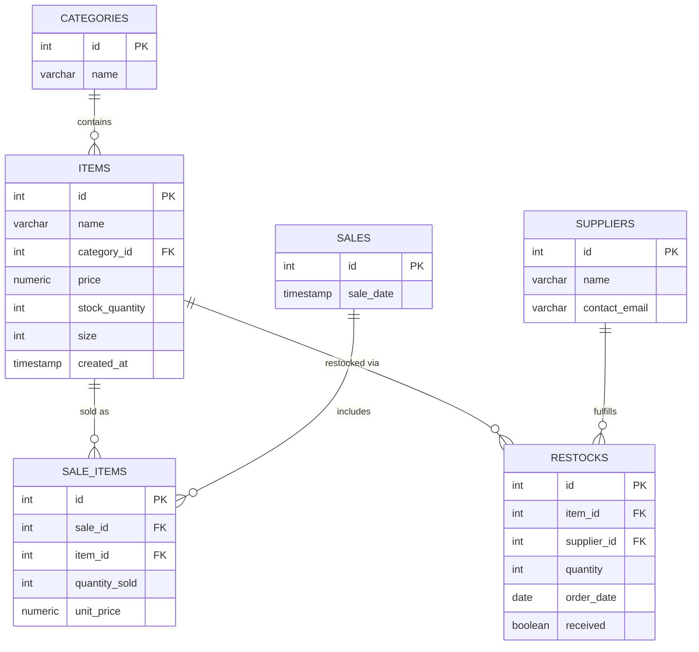

# Entity Relationship Diagram

## Design notes

- **categories** is a lookup table matching the required item categories
  (Cleats, Shirts, Socks, Bags, Jackets, Shorts, Pants, Balls), enforced with
  a CHECK constraint so nothing else can be inserted.
- **items** is the main inventory table. `size` is nullable and only used
  for balls (regulation sizes 3, 4, 5), enforced with a CHECK constraint.
- **sales** and **sale_items** split a sale into a header (when it happened)
  and its line items (what was actually sold), which is standard practice
  and lets one sale include multiple items.
- **suppliers** and **restocks** track where inventory comes from and
  whether an order has actually arrived, giving the store a real
  restocking workflow instead of stock just changing with no history.
